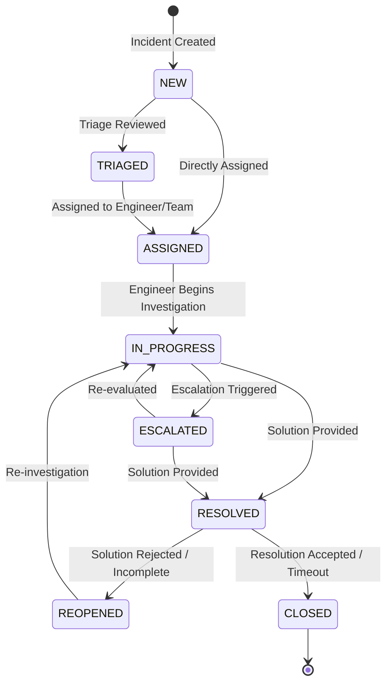

# ResolveAI — AI-Powered Enterprise Incident & Service Management Platform

ResolveAI is an enterprise-grade incident and IT service management platform engineered with modern full-stack practices. It streamlines technical incident triage, SLA enforcement, team assignment, resolution workflows, and knowledge base lookups, augmented by resilient AI assistance and Retrieval-Augmented Generation (RAG).

---

## Table of Contents

- [Overview](#overview)
- [Key Features](#key-features)
- [Architecture Principles](#architecture-principles)
- [Technology Stack](#technology-stack)
- [User Roles & Permissions](#user-roles--permissions)
- [Incident Lifecycle](#incident-lifecycle)
- [Project Documentation](#project-documentation)
- [Prerequisites](#prerequisites)
- [Local Setup & Development](#local-setup--development)
- [Configuration & Environment Variables](#configuration--environment-variables)
- [Development Phases & Roadmap](#development-phases--roadmap)
- [License](#license)

---

## Overview

In enterprise IT operations, resolving service outages quickly and maintaining transparent communication is vital. **ResolveAI** delivers a centralized, auditable platform where:
- **Employees** report technical issues and track progress in real time.
- **Managers** route incidents across teams, monitor workloads, and govern Service Level Agreements (SLAs).
- **Engineers** triage, diagnose, investigate, and resolve incidents with context-aware AI recommendations.
- **Admins** manage roles, teams, categories, audit logs, and SLA policies.

AI recommendations operate as an **advisory copilot** to engineers (summarization, category/severity suggestion, similar incident detection, and RAG resolution suggestions) without treating AI output as unquestioned ground truth.

---

## Key Features

1. **Incident Lifecycle Governance**: Strict state machine enforcing allowed transitions (`NEW` → `TRIAGED` → `ASSIGNED` → `IN_PROGRESS` → `RESOLVED` → `CLOSED`, with `ESCALATED` and `REOPENED` loops) with immutable audit history.
2. **Configurable SLA Engine**: Priority-driven policies (P1 to P4) dynamically computing response and resolution deadlines, tracking breach statuses and warnings.
3. **Role-Based & Resource-Level Authorization**: Granular RBAC ensuring employees view only their incidents, engineers view their assigned/team queues, managers supervise department workloads, and admins configure policies.
4. **Knowledge Base Management**: Searchable and categorizable repository of known errors, symptoms, root causes, and workarounds.
5. **AI Advisory & RAG Pipeline**: Isolated AI service interface providing incident summarization, triage suggestions, and similarity search grounded in historical articles and tickets.
6. **In-App Notification Engine**: Event-driven alerts on assignment changes, status transitions, comments, and impending SLA breaches.
7. **Comprehensive Audit & Analytics**: Real-time database-derived metrics (MTTR, SLA compliance, queue distributions) and immutable audit logging.

---

## Architecture Principles

- **Modular Monolith**: Organized into clean bounded contexts (`auth`, `user`, `team`, `incident`, `sla`, `notification`, `knowledge`, `analytics`, `ai`, `audit`, `common`).
- **Layered Architecture**: Strict `Controller` → `Service` → `Repository` → `Database` flow.
- **DTO Boundaries**: Zero exposure of JPA entities in REST contracts; all payloads are validated Data Transfer Objects.
- **Consistent Error Handling**: Centralized global exception handler emitting standard RFC-compliant error envelopes.
- **Resilient AI Integration**: AI services decoupled via abstract interfaces; platform operates seamlessly even if external AI models are offline or degraded.

---

## Technology Stack

### Backend
- **Language**: Java 21 (LTS)
- **Framework**: Spring Boot 3.3+
- **Security**: Spring Security 6, Stateless JWT (JJWT), BCrypt password hashing
- **Persistence**: Spring Data JPA, Hibernate 6, PostgreSQL 16
- **Database Migrations**: Flyway
- **Caching**: Redis 7 (introduced in later phase for rate limiting and cache-aside)
- **Validation**: Jakarta Bean Validation (`hibernate-validator`)
- **Documentation**: OpenAPI 3 / Swagger (SpringDoc)

### Frontend
- **Framework**: React 18 with TypeScript 5
- **Build Tool**: Vite
- **Routing**: React Router 6
- **HTTP Client**: Axios with centralized request/response interceptors
- **Styling**: Modern responsive CSS / Tailwind CSS
- **Icons**: Lucide React

### Testing & Quality
- **Unit & Integration**: JUnit 5, Mockito, Spring Boot Test, Testcontainers
- **Code Quality**: SOLID principles, strict compile-time checks

### DevOps & Containerization
- **Containers**: Multi-stage Dockerfiles for Backend & Frontend
- **Orchestration**: Docker Compose (PostgreSQL, Redis, Spring Boot backend, Vite/Nginx frontend)
- **CI/CD**: GitHub Actions workflows for automated linting, test execution, and image build verification

---

## User Roles & Permissions

| Role | Core Capabilities |
| :--- | :--- |
| **EMPLOYEE** | Create incidents, view reported tickets, post comments, check status, search knowledge base. |
| **ENGINEER** | Access assigned & team queues, update status, add diagnosis notes, resolve incidents, review AI advisory recommendations. |
| **MANAGER** | Supervise team queues, assign/reassign tickets, monitor SLA health, evaluate team workload and analytics. |
| **ADMIN** | User lifecycle, role assignment, team management, category taxonomy, SLA policy tuning, system audit log inspection. |

---

## Incident Lifecycle



---

## Project Documentation

Detailed architecture and planning documentation is maintained in the [`docs/`](docs/) directory:

- [System Architecture Specification](docs/architecture/architecture.md): Deep-dive into modular structure, security, state machine, and AI/RAG flow.
- [Database Schema & Migration Plan](docs/database/database-design.md): Complete PostgreSQL schema, ER diagram, Flyway migration roadmap, indexing, and constraint definitions.
- [REST API Specification](docs/api/api-plan.md): Complete catalog of endpoints, request/response models, query parameters, and standard error envelopes.
- [Development Roadmap](docs/development-roadmap.md): Phased implementation strategy covering Phases 0 through 18.

---

## Prerequisites

- **Java Development Kit (JDK)**: Version 21 or higher
- **Node.js**: Version 20.x LTS or higher (with npm 10+)
- **PostgreSQL**: Version 16 (or Docker)
- **Docker & Docker Compose**: Latest desktop or engine release
- **Git**: Version 2.40+

---

## Local Setup & Development

### 1. Configure Environment
Copy the `.env.example` template to `.env` (for custom local values):
```bash
cp .env.example .env
```

### 2. Run Backend (Spring Boot 3 + Java 21)
You can compile, test, and run the backend using Maven:
```bash
# From the project root, compile and run automated tests
mvn clean test

# Run the Spring Boot application (defaults to port 8080)
mvn spring-boot:run -pl backend

# Or navigate directly into the backend folder
cd backend
mvn spring-boot:run
```
- **Health Check**: `http://localhost:8080/api/health`
- **Swagger / OpenAPI Documentation**: `http://localhost:8080/swagger-ui.html`

### 3. Run Frontend (React 18 + TypeScript + Vite)
In a separate terminal:
```bash
# Navigate to the frontend directory
cd frontend

# Install dependencies (if not already installed)
npm install

# Start development server (defaults to port 5173)
npm run dev

# Build for production
npm run build
```
- **Frontend URL**: `http://localhost:5173`

---

## Configuration & Environment Variables

ResolveAI enforces a strict secret-free codebase policy. No passwords, JWT secrets, or cloud credentials are committed. A template `.env.example` outlines all required environment variables:

| Variable | Description | Example Default |
| :--- | :--- | :--- |
| `SPRING_PROFILES_ACTIVE` | Active Spring profile | `dev` |
| `DB_HOST` | PostgreSQL host | `localhost` |
| `DB_PORT` | PostgreSQL port | `5432` |
| `DB_NAME` | Database name | `resolveai_db` |
| `DB_USER` | Database username | `postgres` |
| `DB_PASSWORD` | Database password | *Use secure local password* |
| `JWT_SECRET` | 256-bit secret key for HMAC-SHA256 | *Generated 64-char hex key* |
| `JWT_EXPIRATION_MS` | Access token lifespan (ms) | `900000` (15 minutes) |
| `JWT_REFRESH_EXPIRATION_MS` | Refresh token lifespan (ms) | `604800000` (7 days) |
| `AI_PROVIDER` | AI backend provider | `mock` / `openai` / `gemini` |
| `AI_API_KEY` | API Key for LLM provider | *(Optional in dev, mock available)* |

---

## Development Phases & Roadmap

The application is engineered iteratively across 19 planned phases:

- **Phase 0**: Project Planning and Architecture ✅
- **Phase 1**: Backend/Frontend Project Setup ✅
- **Phase 2**: Database and Migrations (Flyway, PostgreSQL) ✅
- **Phase 3**: Authentication (JWT, BCrypt) ✅
- **Phase 4**: Role-Based & Resource-Level Authorization (RBAC) ✅
- **Phase 5**: Incident Management Core (Lifecycle, State Machine, History)
- **Phase 6**: Teams and Assignment Engine
- **Phase 7**: SLA Calculation & Breach Engine
- **Phase 8**: In-App Notification System
- **Phase 9**: Knowledge Base Module
- **Phase 10**: Analytics & Operational Metrics
- **Phase 11**: AI Foundation (Summarization, Triage Suggestions)
- **Phase 12**: RAG & Similarity Search (Vector Embeddings)
- **Phase 13**: Redis Caching & Rate Limiting
- **Phase 14**: Automated Testing & Security Hardening
- **Phase 15**: Docker & Containerization
- **Phase 16**: CI/CD Pipelines
- **Phase 17**: Cloud Deployment Readiness
- **Phase 18**: Final Polish, Demo Scenarios & Release

---

## License

ResolveAI is created for enterprise service management education and demonstration.
