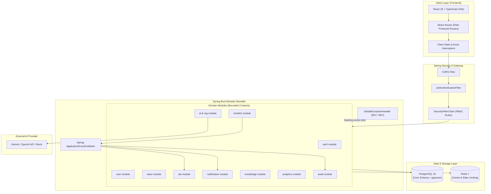
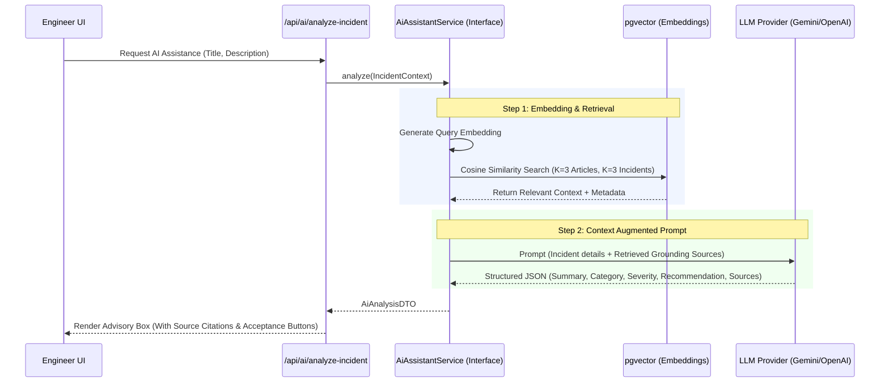

# ResolveAI — System Architecture Specification

## 1. Executive Architecture Summary

ResolveAI is designed as an **Enterprise Modular Monolith** implemented using **Java 21**, **Spring Boot 3.3+**, and **React 18 with TypeScript**.

### Architectural Decision: Modular Monolith vs. Microservices
For an enterprise incident management platform of this scope, a modular monolith was chosen over a distributed microservices architecture for key engineering reasons:
- **Transactional Integrity**: Incident state transitions, SLA record creation, and audit logging require strong ACID guarantees without the overhead of two-phase commits (2PC) or distributed saga orchestrators.
- **Maintainability & Operability**: Single deployable artifact reduces DevOps complexity, minimizes latency from inter-service network hops, and allows simpler local development and testing.
- **Strict Bounded Contexts**: Code is cleanly partitioned into domain packages (`auth`, `user`, `team`, `incident`, `sla`, `notification`, `knowledge`, `analytics`, `ai`, `audit`, `common`). Dependencies between modules are restricted to service interfaces and DTOs, avoiding tangled cross-domain entity dependencies.
- **Evolution Path**: Should team scale require independent deployment later, bounded contexts are already isolated and can be extracted into microservices without rewriting business logic.

---

## 2. High-Level System Architecture



---

## 3. Layered Pattern & Dependency Rules

Each domain module strictly adheres to a 4-tier layer pattern:

```
[ HTTP Requests ]
       ↓
 Controller (REST Endpoints, Request Validation, HTTP status codes)
       ↓
  Service   (Business logic, Transactions, Invariant rules, Domain Events)
       ↓
Repository (Spring Data JPA, Native/JPQL queries, Auditing)
       ↓
 Database  (PostgreSQL tables, Foreign keys, Check constraints, Indexes)
```

### Architectural Rules:
1. **No Business Logic in Controllers**: Controllers only receive DTOs, validate using `@Valid`, delegate to the appropriate Service, and wrap results in standard response structures.
2. **DTO Boundary Enforcement**: JPA Entities must **NEVER** be accepted as controller parameters or returned directly in API responses. DTOs insulate internal database schemas from external API contracts.
3. **Transaction Management**: `@Transactional` is declared at the Service layer with appropriate propagation (`REQUIRED`, `REQUIRES_NEW` for audit logging) and isolation levels (`READ_COMMITTED`).
4. **Inter-Module Communication**: Modules communicate by injecting target domain Service interfaces or publishing asynchronous/transactional application events (`@TransactionalEventListener`). Direct cross-module repository access is prohibited.

---

## 4. Domain Modules (Bounded Contexts)

| Module | Core Responsibility |
| :--- | :--- |
| `common` | Base entities, generic pagination DTOs, global exception handler, RFC error envelopes, constants. |
| `auth` | User registration, login, JWT token issuance/validation, refresh tokens, security principal resolution. |
| `user` | User profiles, account activation/deactivation, password management. |
| `team` | Team structures, department mapping, lead assignment, engineer roster management. |
| `incident` | Incident CRUD, state machine enforcement, assignment tracking, priority/severity, comments, attachments. |
| `sla` | SLA policy definition, deadline calculations (`response_due_at`, `resolution_due_at`), breach tracking. |
| `notification`| In-app notification delivery, unread badge counters, status change notifications. |
| `knowledge` | Knowledge base article lifecycle (Draft, Published, Archived), symptom/cause/resolution documentation. |
| `analytics` | Metric computation (MTTR, SLA compliance rates, workload distribution, trend analysis). |
| `audit` | Append-only security and operational audit trail recording actor, action, timestamp, diffs, and client IP. |
| `ai` | Resilient interface for incident summarization, category/severity suggestion, similarity search, and RAG advisory. |

---

## 5. Incident Lifecycle & State Machine

The incident state machine is the core workflow engine of ResolveAI. Any invalid transition throws an `InvalidStateTransitionException` resulting in an HTTP 400 Bad Request.

### Formal State Transition Table

| Source State | Allowed Destination States | Actor Roles Permitted | Conditions & Side Effects |
| :--- | :--- | :--- | :--- |
| `NEW` | `TRIAGED` | ENGINEER, MANAGER, ADMIN | Initial triage performed; category/priority reviewed. |
| `NEW` | `ASSIGNED` | MANAGER, ADMIN | Directly assigned to an engineer or team. |
| `TRIAGED` | `ASSIGNED` | MANAGER, ADMIN | Assignee or assigned team specified. |
| `ASSIGNED` | `IN_PROGRESS` | ENGINEER (assignee), MANAGER | Engineer acknowledges ticket; SLA `responded_at` stamped if null. |
| `IN_PROGRESS` | `ESCALATED` | ENGINEER, MANAGER, ADMIN | Escalation note required; notification sent to manager. |
| `ESCALATED` | `IN_PROGRESS` | MANAGER, ADMIN | Manager re-evaluates or reassigns ticket. |
| `IN_PROGRESS` | `RESOLVED` | ENGINEER, MANAGER, ADMIN | Resolution notes mandatory; SLA `resolved_at` stamped. |
| `ESCALATED` | `RESOLVED` | ENGINEER, MANAGER, ADMIN | Resolution notes mandatory; SLA `resolved_at` stamped. |
| `RESOLVED` | `REOPENED` | EMPLOYEE (reporter), MANAGER | Reopen reason mandatory; ticket returned to queue. |
| `REOPENED` | `IN_PROGRESS` | ENGINEER, MANAGER, ADMIN | Investigation resumes. |
| `RESOLVED` | `CLOSED` | EMPLOYEE, MANAGER, ADMIN, SYSTEM | Ticket confirmed resolved or closed automatically after 5 business days. |
| `CLOSED` | *None* | *None* | Final terminal state; immutable. |

### Invariant & History Rule
Every state change or assignee mutation triggers an immutable `IncidentHistory` entry recording:
- `incidentId`, `actorId`, `actionType` (`STATUS_CHANGE`, `ASSIGNMENT_CHANGE`, `PRIORITY_CHANGE`, etc.)
- `fieldName`, `oldValue`, `newValue`, and `timestamp`.

---

## 6. Security & Authorization Architecture

### 6.1 Authentication Mechanism
- **Stateless JWT**: Standard Authorization header format `Bearer <token>`.
- **Token Dual-Tier Strategy**:
  - **Access Token**: Short-lived (15 minutes), contains `sub` (user email), `userId`, and `role` claims.
  - **Refresh Token**: Long-lived (7 days), stored in the database with rotation and revocation support.
- **Password Security**: Passwords hashed using **BCrypt** (cost factor 12) with salted digests.

### 6.2 Role-Based Access Control (RBAC) Matrix

| Resource / Action | EMPLOYEE | ENGINEER | MANAGER | ADMIN |
| :--- | :---: | :---: | :---: | :---: |
| **Create Incident** | Yes | Yes | Yes | Yes |
| **View Own Reported Incidents** | Yes | Yes | Yes | Yes |
| **View Team Incidents** | No | Yes (Assigned) | Yes (All Team) | Yes (All) |
| **View All Enterprise Incidents** | No | No | No | Yes |
| **Change Incident Status** | No | Yes (Assigned) | Yes | Yes |
| **Assign / Reassign Incidents** | No | No | Yes | Yes |
| **Add Public Comment** | Yes (Own) | Yes (Assigned) | Yes | Yes |
| **Add Internal Diagnosis Note** | No | Yes | Yes | Yes |
| **View Knowledge Base** | Yes (Published) | Yes (All) | Yes (All) | Yes (All) |
| **Manage Knowledge Articles** | No | Yes (Create/Edit) | Yes | Yes |
| **View Team Analytics & SLA** | No | No | Yes | Yes |
| **Configure SLA Policies** | No | No | Yes | Yes |
| **User & Team Administration** | No | No | Yes (Teams) | Yes |
| **View System Audit Logs** | No | No | No | Yes |

### 6.3 Resource-Level Security
In addition to role checks (`@PreAuthorize("hasRole('ENGINEER')")`), method-level resource ownership checks ensure that:
- Employees cannot fetch `/api/incidents/{id}` unless `incident.reporterId == currentUserId`.
- Engineers can update incidents only if they are assigned to the incident or belong to the assigned team.

---

## 7. Configurable SLA Architecture

SLA rules are never hardcoded. They are dynamically driven by the `sla_policies` table and calculated upon incident creation.

### Priority Levels & Dynamic Timers
- **P1 — Critical**: Configurable response (e.g., 15 mins) & resolution (e.g., 2 hours). Escalation trigger after 1 hour without progress.
- **P2 — High**: Configurable response (e.g., 30 mins) & resolution (e.g., 8 hours).
- **P3 — Medium**: Configurable response (e.g., 2 hours) & resolution (e.g., 24 hours).
- **P4 — Low**: Configurable response (e.g., 4 hours) & resolution (e.g., 72 hours).

### SLA Lifecycle Engine
1. **Creation**: Determine priority → Match active policy → Calculate `response_due_at = created_at + response_time` and `resolution_due_at = created_at + resolution_time` → Persist `sla_records`.
2. **First Response**: First engineer status update (`TRIAGED`, `ASSIGNED`, `IN_PROGRESS`) or explicit assignment stamps `responded_at`. If `responded_at > response_due_at`, flags `is_response_breached = TRUE`.
3. **Resolution**: Transition to `RESOLVED` stamps `resolved_at`. If `resolved_at > resolution_due_at`, flags `is_resolution_breached = TRUE`. Reopening ticket resets `resolved_at`.
4. **Closure**: Transition to `CLOSED` preserves terminal SLA audit state.
5. **Breach Evaluation**: Service-level evaluation (`SlaService.scanAndEvaluateActiveBreaches`) checks overdue pending tickets against current reference time. Background scheduling will be added in operational phases.

---

## 8. AI & RAG Subsystem Architecture

AI capabilities are designed with high resilience and advisory boundaries.



### AI Guiding Principles:
1. **Provider Isolation**: The core application injects `AiAssistantService`. Implementation adapters (`GeminiAiAdapter`, `OpenAiAdapter`, `MockAiAdapter`) can be swapped via configuration (`ai.provider=mock`).
2. **Fault Tolerance**: If the LLM call times out or throws an error (quota, 503, parse error), the service catches the exception and returns a fallback DTO (`isAvailable=false, fallbackMessage="AI assistance is currently unavailable."`). **The main incident workflow is never blocked.**
3. **Advisory Semantics**: AI output is explicitly labeled as *recommendation*. The engineer must click "Accept Suggestion" to populate fields.

---

## 9. In-App Notification System

- Event-driven using Spring's `ApplicationEventPublisher`.
- Domain events: `IncidentAssignedEvent`, `IncidentStatusChangedEvent`, `CommentAddedEvent`, `SlaBreachedEvent`.
- Handled by `@TransactionalEventListener(phase = TransactionPhase.AFTER_COMMIT)` to ensure notifications are only generated if database transactions commit successfully.
- Notifications stored in `notifications` table; unread counts polled or pushed via REST polling/WebSocket.

---

## 10. Redis Integration Architecture (Phased)

To be enabled in Phase 13 without impacting earlier phases:
- **Cache-Aside (`@Cacheable`)**:
  - `categories` list (TTL: 1 hour)
  - `sla_policies` list (TTL: 1 hour)
  - Dashboard analytics summary (TTL: 5 minutes)
- **Cache Invalidation (`@CacheEvict`)**:
  - Admin updates to categories or SLA policies clear corresponding caches immediately.
- **Rate Limiting**:
  - Token bucket filter on `/api/auth/login` (prevent brute-force: 5 requests / min per IP).
  - Rate limiting on `/api/ai/*` (prevent LLM quota exhaustion: 10 requests / min per user).

---

## 11. Role-Based Access Control (RBAC) & Authorization Architecture

ResolveAI implements a defense-in-depth authorization model combining stateless JWT identity verification with Spring Security method-level access control.

### 11.1 Roles and Authorities Mapping
System roles are represented by the `roles` entity in PostgreSQL and mapped into Spring Security `GrantedAuthority` tokens with a canonical `ROLE_` prefix:

| Role Name | GrantedAuthority | Intended Domain Scope |
| :--- | :--- | :--- |
| `EMPLOYEE` | `ROLE_EMPLOYEE` | Ticket reporting, personal profile access, employee resources. |
| `ENGINEER` | `ROLE_ENGINEER` | Ticket triage, incident investigation, technical KB contributions. |
| `MANAGER` | `ROLE_MANAGER` | Team incident assignment, SLA monitoring, escalation handling. |
| `ADMIN` | `ROLE_ADMIN` | Global configuration, user administration, full system access. |

### 11.2 Method-Level Security
- Declared globally via `@EnableMethodSecurity(prePostEnabled = true)` on `SecurityConfig`.
- Controllers and services declare granular access boundaries using `@PreAuthorize("hasAnyRole('...', '...')")`.
- Avoids implicit role hierarchy assumptions (`ADMIN > MANAGER > ENGINEER > EMPLOYEE`); permissions are explicitly assigned to each endpoint to prevent accidental privilege leakage.

### 11.3 Status Code Separation: 401 vs. 403
- **`401 UNAUTHORIZED`**: Dispatched by `JwtAuthenticationEntryPoint` when an incoming request lacks a valid Bearer token, has a malformed token, or has an expired token.
- **`403 FORBIDDEN`**: Dispatched by `JwtAccessDeniedHandler` (filter chain) or `GlobalExceptionHandler` (method security) when the user identity is verified, but their granted roles do not satisfy the required endpoint permission. Both emit the standard RFC-compliant `ApiErrorResponse` JSON envelope.

### 11.4 Authoritative Authority Source
To prevent security vulnerabilities arising from stale JWT claims after a database role modification, the `JwtAuthenticationFilter` loads the `UserDetails` principal via `CustomUserDetailsService` against the authoritative database entity on each authenticated request.

### 11.5 Foundation for Resource-Level Authorization (Phase 5+)
The `AuthorizationService` bean provides programmatic and SpEL-compatible methods (`hasRole`, `hasAnyRole`, `isAdmin`, `isCurrentUser`, `canAccessIncident`) establishing a clean architectural foundation for Phase 5 incident-level ownership checks (e.g., employee viewing own tickets, engineer viewing assigned tickets, manager viewing team tickets).

