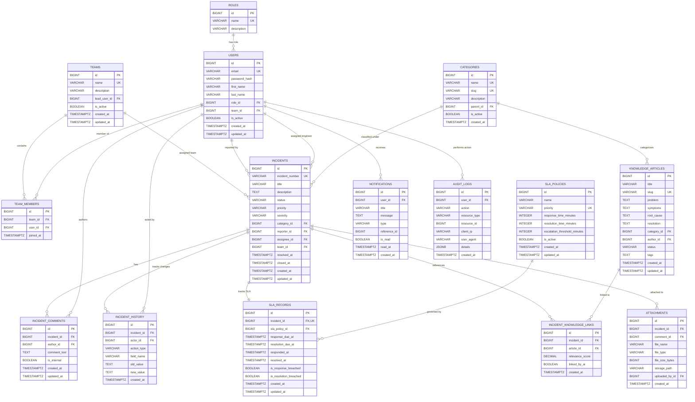

# ResolveAI — Database Schema & Migration Specification

## 1. Database Principles & Conventions

- **Database Engine**: PostgreSQL 16 (supporting JSONB and `pgvector` for vector embeddings).
- **Migration Tool**: Flyway versioned migrations (`V1__...`, `V2__...`).
- **Primary Keys**: Auto-incrementing `BIGINT GENERATED ALWAYS AS IDENTITY` for high throughput and predictable b-tree performance. High-entropy business identifiers (`incident_number` like `INC-20260905-001`) used for public-facing URLs.
- **Timestamps**: All timestamps stored as `TIMESTAMPTZ` (UTC) with default `CURRENT_TIMESTAMP`.
- **Soft Delete vs Active Flags**: `is_active BOOLEAN NOT NULL DEFAULT TRUE` for entities requiring deactivation (users, teams, categories, policies) to preserve foreign key history integrity.
- **Auditing Columns**: Tables track `created_at` and `updated_at`.

---

## 2. Entity-Relationship Diagram (ERD)



---

## 3. Detailed Table Schema Definitions

### 3.1 `roles`
Stores application roles (`EMPLOYEE`, `ENGINEER`, `MANAGER`, `ADMIN`).
```sql
CREATE TABLE roles (
    id BIGINT GENERATED ALWAYS AS IDENTITY PRIMARY KEY,
    name VARCHAR(50) NOT NULL UNIQUE,
    description VARCHAR(255),
    created_at TIMESTAMPTZ NOT NULL DEFAULT CURRENT_TIMESTAMP
);
```

### 3.2 `teams`
Organizational service desks and engineering squads.
```sql
CREATE TABLE teams (
    id BIGINT GENERATED ALWAYS AS IDENTITY PRIMARY KEY,
    name VARCHAR(100) NOT NULL UNIQUE,
    description VARCHAR(500),
    lead_user_id BIGINT,
    is_active BOOLEAN NOT NULL DEFAULT TRUE,
    created_at TIMESTAMPTZ NOT NULL DEFAULT CURRENT_TIMESTAMP,
    updated_at TIMESTAMPTZ NOT NULL DEFAULT CURRENT_TIMESTAMP
);
```

### 3.3 `users`
System user profiles and credentials.
```sql
CREATE TABLE users (
    id BIGINT GENERATED ALWAYS AS IDENTITY PRIMARY KEY,
    email VARCHAR(150) NOT NULL UNIQUE,
    password_hash VARCHAR(255) NOT NULL,
    first_name VARCHAR(100) NOT NULL,
    last_name VARCHAR(100) NOT NULL,
    role_id BIGINT NOT NULL REFERENCES roles(id),
    team_id BIGINT REFERENCES teams(id) ON DELETE SET NULL,
    is_active BOOLEAN NOT NULL DEFAULT TRUE,
    created_at TIMESTAMPTZ NOT NULL DEFAULT CURRENT_TIMESTAMP,
    updated_at TIMESTAMPTZ NOT NULL DEFAULT CURRENT_TIMESTAMP
);

-- Foreign key for team lead
ALTER TABLE teams ADD CONSTRAINT fk_teams_lead_user FOREIGN KEY (lead_user_id) REFERENCES users(id) ON DELETE SET NULL;
```

### 3.4 `team_members`
Many-to-many relationship between users and teams.
```sql
CREATE TABLE team_members (
    id BIGINT GENERATED ALWAYS AS IDENTITY PRIMARY KEY,
    team_id BIGINT NOT NULL REFERENCES teams(id) ON DELETE CASCADE,
    user_id BIGINT NOT NULL REFERENCES users(id) ON DELETE CASCADE,
    joined_at TIMESTAMPTZ NOT NULL DEFAULT CURRENT_TIMESTAMP,
    CONSTRAINT uk_team_user UNIQUE (team_id, user_id)
);
```

### 3.5 `categories`
Hierarchical ITIL category taxonomy (e.g. Hardware, Network, Database, Security).
```sql
CREATE TABLE categories (
    id BIGINT GENERATED ALWAYS AS IDENTITY PRIMARY KEY,
    name VARCHAR(100) NOT NULL,
    slug VARCHAR(120) NOT NULL UNIQUE,
    description VARCHAR(500),
    parent_id BIGINT REFERENCES categories(id) ON DELETE RESTRICT,
    is_active BOOLEAN NOT NULL DEFAULT TRUE,
    created_at TIMESTAMPTZ NOT NULL DEFAULT CURRENT_TIMESTAMP
);
```

### 3.6 `sla_policies`
Configurable response and resolution thresholds per priority tier.
```sql
CREATE TABLE sla_policies (
    id BIGINT GENERATED ALWAYS AS IDENTITY PRIMARY KEY,
    name VARCHAR(100) NOT NULL,
    priority VARCHAR(10) NOT NULL UNIQUE CHECK (priority IN ('P1', 'P2', 'P3', 'P4')),
    response_time_minutes INTEGER NOT NULL CHECK (response_time_minutes > 0),
    resolution_time_minutes INTEGER NOT NULL CHECK (resolution_time_minutes > 0),
    escalation_threshold_minutes INTEGER NOT NULL CHECK (escalation_threshold_minutes > 0),
    is_active BOOLEAN NOT NULL DEFAULT TRUE,
    created_at TIMESTAMPTZ NOT NULL DEFAULT CURRENT_TIMESTAMP,
    updated_at TIMESTAMPTZ NOT NULL DEFAULT CURRENT_TIMESTAMP
);
```

### 3.7 `incidents`
Core incident ticket record.
```sql
CREATE TABLE incidents (
    id BIGINT GENERATED ALWAYS AS IDENTITY PRIMARY KEY,
    incident_number VARCHAR(32) NOT NULL UNIQUE,
    title VARCHAR(200) NOT NULL,
    description TEXT NOT NULL,
    status VARCHAR(30) NOT NULL DEFAULT 'NEW' 
        CHECK (status IN ('NEW', 'TRIAGED', 'ASSIGNED', 'IN_PROGRESS', 'ESCALATED', 'RESOLVED', 'REOPENED', 'CLOSED')),
    priority VARCHAR(10) NOT NULL DEFAULT 'P3'
        CHECK (priority IN ('P1', 'P2', 'P3', 'P4')),
    severity VARCHAR(10) NOT NULL DEFAULT 'MEDIUM'
        CHECK (severity IN ('CRITICAL', 'HIGH', 'MEDIUM', 'LOW')),
    category_id BIGINT REFERENCES categories(id) ON DELETE RESTRICT,
    reporter_id BIGINT NOT NULL REFERENCES users(id),
    assignee_id BIGINT REFERENCES users(id) ON DELETE SET NULL,
    team_id BIGINT REFERENCES teams(id) ON DELETE SET NULL,
    resolved_at TIMESTAMPTZ,
    closed_at TIMESTAMPTZ,
    created_at TIMESTAMPTZ NOT NULL DEFAULT CURRENT_TIMESTAMP,
    updated_at TIMESTAMPTZ NOT NULL DEFAULT CURRENT_TIMESTAMP
);
```

### 3.8 `sla_records`
Exact SLA tracking deadlines, responses, and breach statuses per incident (1:1 with `incidents`).
```sql
CREATE TABLE sla_records (
    id BIGINT GENERATED ALWAYS AS IDENTITY PRIMARY KEY,
    incident_id BIGINT NOT NULL UNIQUE REFERENCES incidents(id) ON DELETE CASCADE,
    sla_policy_id BIGINT NOT NULL REFERENCES sla_policies(id),
    response_due_at TIMESTAMPTZ NOT NULL,
    resolution_due_at TIMESTAMPTZ NOT NULL,
    responded_at TIMESTAMPTZ,
    resolved_at TIMESTAMPTZ,
    is_response_breached BOOLEAN NOT NULL DEFAULT FALSE,
    is_resolution_breached BOOLEAN NOT NULL DEFAULT FALSE,
    created_at TIMESTAMPTZ NOT NULL DEFAULT CURRENT_TIMESTAMP,
    updated_at TIMESTAMPTZ NOT NULL DEFAULT CURRENT_TIMESTAMP
);
```

### 3.9 `incident_comments`
Discussion stream on incidents (supports public customer comments and internal engineer notes).
```sql
CREATE TABLE incident_comments (
    id BIGINT GENERATED ALWAYS AS IDENTITY PRIMARY KEY,
    incident_id BIGINT NOT NULL REFERENCES incidents(id) ON DELETE CASCADE,
    author_id BIGINT NOT NULL REFERENCES users(id),
    comment_text TEXT NOT NULL,
    is_internal BOOLEAN NOT NULL DEFAULT FALSE,
    created_at TIMESTAMPTZ NOT NULL DEFAULT CURRENT_TIMESTAMP,
    updated_at TIMESTAMPTZ NOT NULL DEFAULT CURRENT_TIMESTAMP
);
```

### 3.10 `incident_history`
Append-only log of changes to incident state, priority, and assignments.
```sql
CREATE TABLE incident_history (
    id BIGINT GENERATED ALWAYS AS IDENTITY PRIMARY KEY,
    incident_id BIGINT NOT NULL REFERENCES incidents(id) ON DELETE CASCADE,
    actor_id BIGINT NOT NULL REFERENCES users(id),
    action_type VARCHAR(50) NOT NULL,
    field_name VARCHAR(50) NOT NULL,
    old_value TEXT,
    new_value TEXT,
    created_at TIMESTAMPTZ NOT NULL DEFAULT CURRENT_TIMESTAMP
);
```

### 3.11 `knowledge_articles`
Structured IT service articles containing diagnostic guidance and known fixes.
```sql
CREATE TABLE knowledge_articles (
    id BIGINT GENERATED ALWAYS AS IDENTITY PRIMARY KEY,
    title VARCHAR(250) NOT NULL,
    slug VARCHAR(280) NOT NULL UNIQUE,
    problem TEXT NOT NULL,
    symptoms TEXT NOT NULL,
    root_cause TEXT,
    resolution TEXT NOT NULL,
    category_id BIGINT REFERENCES categories(id) ON DELETE RESTRICT,
    author_id BIGINT NOT NULL REFERENCES users(id),
    status VARCHAR(20) NOT NULL DEFAULT 'DRAFT' CHECK (status IN ('DRAFT', 'PUBLISHED', 'ARCHIVED')),
    tags VARCHAR(500),
    created_at TIMESTAMPTZ NOT NULL DEFAULT CURRENT_TIMESTAMP,
    updated_at TIMESTAMPTZ NOT NULL DEFAULT CURRENT_TIMESTAMP
);
```

### 3.12 `incident_knowledge_links`
Traceability links between incidents and matching knowledge base articles.
```sql
CREATE TABLE incident_knowledge_links (
    id BIGINT GENERATED ALWAYS AS IDENTITY PRIMARY KEY,
    incident_id BIGINT NOT NULL REFERENCES incidents(id) ON DELETE CASCADE,
    article_id BIGINT NOT NULL REFERENCES knowledge_articles(id) ON DELETE CASCADE,
    relevance_score DECIMAL(5, 4) DEFAULT 1.0000,
    linked_by_ai BOOLEAN NOT NULL DEFAULT FALSE,
    created_at TIMESTAMPTZ NOT NULL DEFAULT CURRENT_TIMESTAMP,
    CONSTRAINT uk_incident_article UNIQUE (incident_id, article_id)
);
```

### 3.13 `notifications`
In-app notifications for users.
```sql
CREATE TABLE notifications (
    id BIGINT GENERATED ALWAYS AS IDENTITY PRIMARY KEY,
    user_id BIGINT NOT NULL REFERENCES users(id) ON DELETE CASCADE,
    title VARCHAR(150) NOT NULL,
    message TEXT NOT NULL,
    type VARCHAR(50) NOT NULL,
    reference_id BIGINT,
    is_read BOOLEAN NOT NULL DEFAULT FALSE,
    read_at TIMESTAMPTZ,
    created_at TIMESTAMPTZ NOT NULL DEFAULT CURRENT_TIMESTAMP
);
```

### 3.14 `audit_logs`
Immutable compliance and security audit trails.
```sql
CREATE TABLE audit_logs (
    id BIGINT GENERATED ALWAYS AS IDENTITY PRIMARY KEY,
    user_id BIGINT REFERENCES users(id) ON DELETE SET NULL,
    action VARCHAR(100) NOT NULL,
    resource_type VARCHAR(50) NOT NULL,
    resource_id BIGINT,
    client_ip VARCHAR(45),
    user_agent VARCHAR(255),
    details JSONB,
    created_at TIMESTAMPTZ NOT NULL DEFAULT CURRENT_TIMESTAMP
);
```

### 3.15 `attachments`
Metadata for uploaded diagnostic files and screenshots.
```sql
CREATE TABLE attachments (
    id BIGINT GENERATED ALWAYS AS IDENTITY PRIMARY KEY,
    incident_id BIGINT NOT NULL REFERENCES incidents(id) ON DELETE CASCADE,
    comment_id BIGINT REFERENCES incident_comments(id) ON DELETE SET NULL,
    file_name VARCHAR(255) NOT NULL,
    file_type VARCHAR(100) NOT NULL,
    file_size_bytes BIGINT NOT NULL,
    storage_path VARCHAR(500) NOT NULL,
    uploaded_by_id BIGINT NOT NULL REFERENCES users(id),
    created_at TIMESTAMPTZ NOT NULL DEFAULT CURRENT_TIMESTAMP
);
```

---

## 4. Indexing Strategy

To guarantee low latency under enterprise query patterns:

```sql
-- Incident Query Filters & Queues
CREATE INDEX idx_incidents_status ON incidents(status);
CREATE INDEX idx_incidents_priority ON incidents(priority);
CREATE INDEX idx_incidents_reporter ON incidents(reporter_id);
CREATE INDEX idx_incidents_assignee ON incidents(assignee_id);
CREATE INDEX idx_incidents_team ON incidents(team_id);
CREATE INDEX idx_incidents_team_status ON incidents(team_id, status);
CREATE INDEX idx_incidents_created_at ON incidents(created_at DESC);

-- SLA Breach Monitor Queries
CREATE INDEX idx_sla_records_resolution_pending 
    ON sla_records(is_resolution_breached, resolution_due_at) 
    WHERE resolved_at IS NULL;

CREATE INDEX idx_sla_records_response_pending 
    ON sla_records(is_response_breached, response_due_at) 
    WHERE responded_at IS NULL;

-- Notification lookups
CREATE INDEX idx_notifications_user_unread 
    ON notifications(user_id, is_read, created_at DESC);

-- Knowledge Base Full-Text Search
CREATE INDEX idx_kb_search 
    ON knowledge_articles USING GIN (to_tsvector('english', title || ' ' || problem || ' ' || symptoms));

-- Audit Log Inspection
CREATE INDEX idx_audit_logs_resource 
    ON audit_logs(resource_type, resource_id, created_at DESC);
CREATE INDEX idx_audit_logs_user 
    ON audit_logs(user_id, created_at DESC);
```

---

## 5. Flyway Migration Strategy

Database versioning is structured incrementally across migration scripts:

| File Name | Migration Scope |
| :--- | :--- |
| `V1__init_auth_and_users.sql` | `roles`, `teams`, `users`, `team_members` |
| `V2__init_categories_and_sla_policies.sql` | `categories`, `sla_policies` |
| `V3__init_incidents_and_sla_records.sql` | `incidents`, `sla_records`, `incident_history`, `incident_comments`, `attachments` |
| `V4__init_knowledge_base.sql` | `knowledge_articles`, `incident_knowledge_links` |
| `V5__init_notifications_and_audit.sql` | `notifications`, `audit_logs` |
| `V6__seed_initial_data.sql` | Standard roles, initial admin account, default categories, default P1-P4 SLA policies |
